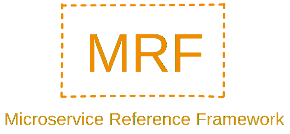

    

# Microservice Reference Framework
A main repository with the Microservice Reference Framework

## Framework structure
1. [Introduction](./framework/introduction/ "Link to introduction")
2. Motivation
3. Guide
4. Microservice architecture description
5. Characteristics of microservices
6. Business cases
    - Business case 1
    - Business case 2
7. On-hands project
    - Introduction to the project
    - Running the project
    - Extending functionality of the system
    - Mapping of microservice characteristics
8. Summary

## Connected repositories
This section contains a list of repositories that are connected to this main one.
- [Recognition service repository](https://github.com/MichalMoudry/mrf-recognition-service "Link to Recognition service's GitHub repository")
- [Workflow service repository](https://github.com/MichalMoudry/mrf-workflow-service "Link to Workflow service's GitHub repository")
- [Analytics service repository](https://github.com/MichalMoudry/mrf-analytics-service "Link to Analytics service's GitHub repository")
- [User service repository](https://github.com/MichalMoudry/mrf-user-service "Link to User service's GitHub repository")
