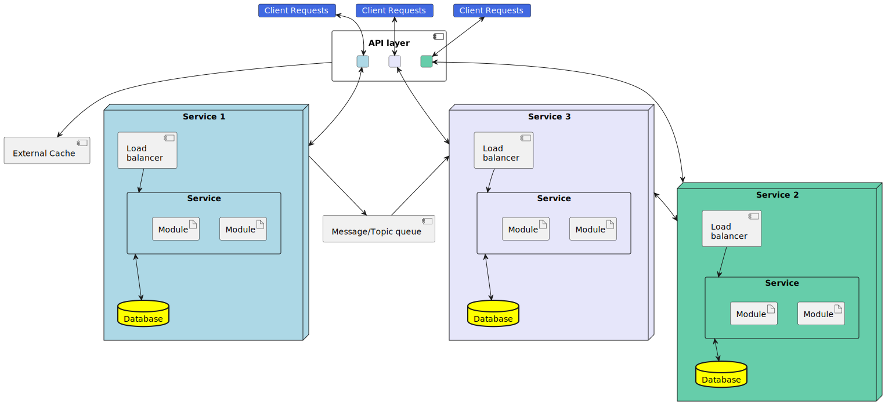

# Popis architektury mikroslužeb

## Přehled a popis
**Mikroslužby** nebo také **Architektura mikroslužeb** označuje architektonický styl pro tvorbu softwarových řešení, které jsou založeny na množině služeb, přičemž jednotlivé služby jsou nasaditelné nezávisle na ostatních službách a jsou modelovány okolo stanovené business domény (tzn. obalují business funkcionalitu a poskytují ji skrze definované rozhraní). Tyto služby běží ve vlastních procesech a nejsou mezi nimi přímé závislosti, přičemž pro komunikaci mezi sebou využívají asynchronní komunikaci.

Tedy systémy založené na architektuře mikroslužeb patří mezi typ distribuovaných systémů. Co se týče rozdílu nebo vztahu mezi mikroslužbami a <abbr title="Service Oriented Architecture">SOA</abbr>, tak mikroslužby jsou typem SOA, který jasně definuje způsob, jak mají být hranice služeb vymezovány.

## Referenční model mikroslužeb
V této podkapitole je uveden referenční model architektury mikroslužeb. Tedy jde o obecný model komponent systému založených na dané architektuře.

- **Client Requests** - jde o dotazy od klientských aplikací na různé služby. Tyto dotazy mohou například být ve formě HTTP dotazů, ale závisí na architektuře API vrstvy.
- **API Layer** - Jde o jednotný bod pro přístup k službám v systému. Jde o implementaci Gateway vzoru. Výhodou tohoto přístupu je centrální řízení autentizace a autorizace klientů, dále v rámci této vrstvy může dojít ke cachování odpovědí na dotazy.
- **External Cache** - Jde o možnou komponentu, která není součástí API vrstvy, ale tato vrstva ji může využívat pro získání dočasných dat , jež by trvalo dlouho získat z příslušných systémů, resp. jejich databází.
- **Service** - Jde o celou mikroslužbu, přičemž nejde o proces, ale spíše jen o seskupení v rámci diagramu/modelu.
    - *Load balancer* - Jedná se o volitelný mechanismus pro řízení škálování a elasticity služby, kdy může existovat 1 až N služeb. Provoz bude vhodně posílán na instance/repliky, které mají volné vypočtení prostředky. Konkrétním příkladem toho nasazení je Kubernetes, kdy jednotlivé instance jsou tzv. pody a těm se dynamicky přiděluje provoz na základě jejich dostupnosti nebo vytížení.
    - *Service* (component) - Jde o konkrétní instanci služby.
        - Modul - Označuje in-process komponentu, resp. modul služby
    - *Database* - Může označovat <abbr title="Systém řízení báze dat">SŘBD</abbr>, databázi nebo databázové schéma, přičemž záleží, jestli byly služby logicky nebo fyzicky odděleny.
- **Message/Topic Queue** - Jde komponentu, která umožňuje realizovat asynchronní komunikaci mezi službami v systému.
    - Populárním přístupem je zde využití tzv. pub-sub vzoru, kdy některé služby jsou v roli vydavatele (`publisher`) nebo odběratele (`subscriber`).
    - Vydavatelé publikují události  s určitým tématem, přičemž na odběr daného tématu může být přihlášeno 0 až N odběratelů. Tedy pokud je služba přihlášena na odběr událostí specifického tématu, tak od <abbr title="Message Queue">MQ</abbr> dostane na příslušný koncový bod data v případě, že byla nějaká událost publikována.
    - Samozřejmě publikované události mohou být mohou být přijímány více odběrateli, přičemž většinou je garantováno jedno doručení zprávy (závisí, jak je <abbr title="Message Queue">MQ</abbr> nakonfigurována).
    - Příkladem této komponenty jsou tyto: Azure Service Bus, AWS Simple Queue Service