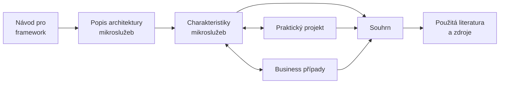

# Návod pro framework
Tato stránka obsahuje návod zobrazující vztahy mezi jednotlivými artefakty. Také pomocí tohot návodu lze strukturovat materiály pro výuku mikroslužeb.

---

!> Samotný Rámec nevyžaduje využití všech jeho artefaktů (včetně jejich vazeb). **Lze tedy využít jen jeho části**.

Katalog diagramu:
- **Popis architektury mikroslužeb** - Tato kapitola obsahuje high-level přehled, popis a referenční model architektury mikroslužeb.
- **Charakteristiky mikroslužeb** - Charakteristiky architektonických stylů jsou jedním z nejdůležitějších aspektů v rámci disciplíny softwarových architektur, protože v rámci rozhodování o architektuže je třeba porovnávat pro a proti, jež plynou z vlastností analyzovaných architektur. Tedy charakteristikám mikroslužeb dedikována oddělená kapitola.
- **Business případy pro mikroslužby** - This artifact revolves around discussion around practical real world applications of microservices. This can be used to showcase the advanteges, disadvantages and a realty of actually applying this architectural style.
- **Praktický projekt** - Mít diskusi nad reálnými aplikacemi mikroslužeb je velice cenné, ale je také důležité si vyzkoušet tuto architekturu, resp. její implementaci (např. pro prezentaci proof-of-concept pro exitující systémy). Z tohoto důvodu je součástí tohoto Rámce i praktický projekt/SW řešení demonostrující tento architektonický styl. Pro tuto demonstraci bylo připravení i <abbr title="Graphical User Interface">GUI</abbr> pro ovládání systému.
- **Souhrn** - Tato část je konec toho Rámce, tedy zde najdete následující prvky:
    - _Spojení charakteristik mikroslužeb s praxí_ - Zde jsou uvedeny přímé spojení mezi charakteristikami mikroslužeb a konkrétních příkladů (na reálných projektech nebo ukázkové aplikaci).
    - _Pokročilá témata_ - Pro mě bylo důležité úvést seznam pokročilých témat týkajících se mikroslužeb. Cílem této části je poskytnout rozcestník pro navazující hlubší zkoumání tohoto architektonického vzoru.
- **Použité zdroje a literatura** - Tato kapitola obsahuje zdroje a literaturu použitou pro tento Rámec. Tento seznam lze také využít pro další studium této architektury.