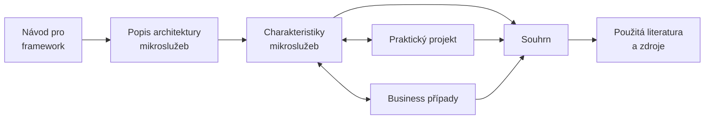

# Návod pro framework
Tato stránka obsahuje návod zobrazující vztahy mezi jednotlivými artefakty. Také pomocí tohot návodu lze strukturovat materiály pro výuku mikroslužeb.

---

!> Samotný Rámec vyžaduje využití všech jeho artefaktů (včetně jejich vazeb). Lze tedy využít jen jeho části.

Katalog diagramu:
- **Popis architektury mikroslužeb** - Tato kapitola obsahuje high-level přehled, popis a referenční model architektury mikroslužeb.
- **Charakteristiky mikroslužeb** - Charakteristiky architektonických stylů jsou jedním z nejdůležitějších aspektů v rámci disciplíny softwarových architektur, protože v rámci rozhodování o architektuže je třeba porovnávat pro a proti, jež plynou z vlastností analyzovaných architektur. Tedy charakteristikám mikroslužeb dedikována oddělená kapitola.
- **Business případy pro mikroslužby** - This artifact revolves around discussion around practical real world applications of microservices. This can be used to showcase the advanteges, disadvantages and a realty of actually applying this architectural style.
- **Praktický projekt** - Having a discussion around real world applications of microservices is extremely valuable, but it is also important to have a more hand-on experience with implementation of an architecture. For this reason I have prepared a sample project/solution to demonstrate microservices with the option to explore its implementation throught its source code or <abbr title="Graphical User Interface">GUI</abbr>.
- **Souhrn** - This section is the conclusion of this framework. So, here you can find the summary of microservices. This includes the following:
    - _Mapping of microservice characteristics_ - This subsection contains direct relations between architectural characteristics and how they are manifested in the sample solution and real world applications.
    - _Pokročilá témata_ - It was important for me to include a list of more advanced topics related to microservice as a waypoint for diving deeper into microservices.
- **Použité zdroje a literatura** - This chapter can server as a list of recommended literature for further studies in this architectural style.