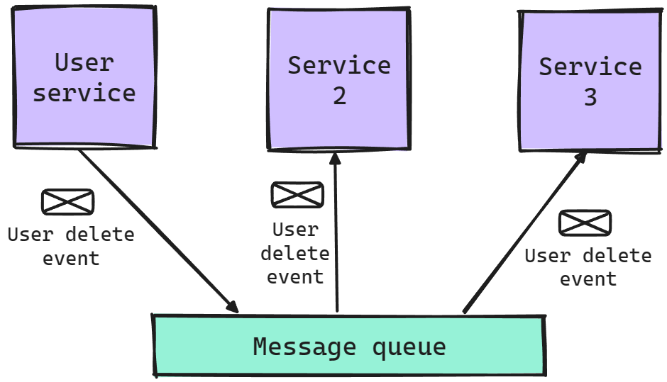

# Charakteristiky mikroslužeb
Mezi nejdůležitější nebo základní vybrané charakteristiky architektury mikroslužeb byly zvoleny následující:
- rozdělení systému na komponenty za pomoci služeb,
- organizace okolo business funkcí, resp. domén,
- nezávislost služeb a nezávislé nasazování,
- automatizace infrastruktury,
- decentralizovaný governance a správa dat,
- design orientovaný na odolnost a chyby a
- chytré koncové body s jednoduchými komunikačními kanály.

### Rozdělení systému na komponenty za pomoci služeb
Označuje rozdělení systému na nezávislé a nezávisle nasazené procesy. Tedy oproti monolitické architektuře, kde rozdělení by spočívalo ve využívání knihoven (nebo modulů) a jakákoliv změna znamená nutnost nasadit celou aplikaci. Na rozdíl u mikroslužeb stačí nasadit pouze službu, kde došlo k příslušným změnám. Samozřejmě v případě změny v rámci kontraktů (např. změna v požadovaných polích těla HTTP dotazů ), resp. rozhraní je třeba dodatečná koordinace mezi týmy/vlastníky služeb. Mimo nezávislé nasazení služeb/komponent systému je i výhodou efektivnější adaptace na změny v rámci businessu, který SW systém podporuje.
### Organizace okolo business domén
Je atribut mikroslužeb, jež spočívá v organizaci jednotlivých služeb podle poskytovaných business funkcí. Tedy týmy odpovědné za celý systém jsou rozděleny do tzv. cross–funkčních týmů, které mají na starost všechny aspekty (uživatelské rozhraní, backend a persistence dat) služby nebo služeb, které jim byly přiřazeny.
### Nezávislost služeb a jejich nasazování
Je vlastnost, která spočívá v tom, že jednotlivé služby vlastní svoje data (tzn. žádné služby mezi sebou nesdílejí svoje databáze) a komunikují mezi sebou asynchronně. Asynchronní komunikace v tomto kontextu označuje komunikaci za využití tzv. Message queue  komponenty, jež zajišťuje přijímání zpráv a jejich odesílání příslušným příjemcům/službám. Tento způsob je ilustrován na obrázku níže (viz [Obrázek č. 1](#Test)). Vzhledem k tomu, že mezi službami neexistují přímé závislosti, tak lze změny služeb nasadit do produkčního prostředí bez ovlivnění ostatních služeb. Výsledkem této charakteristiky je podpora polyglot prostředí, resp. heterogenních služeb, což označuje možnost naprogramovat jednotlivé služby v různých programovacích jazycích.



Na tomto obrázku lze vidět celkem tři služby a MQ komponentu, přičemž uživatelská služba publikuje událost do MQ, že byl smazán uživatel. K dané události jsou přihlášené ostatní služby, které při jejím obdržení smažou data spojená se smazaným uživatelem, resp. jeho účtem. Co dělá komunikaci zde asynchronní, tak je to skutečnost, že jednotlivé služby nikdy mezi sebou přímo nekomunikují, tedy na dotaz pro smazání uživatelských dat v systému uživatelská služba nikdy nečeká na odpověď od všech ostatních služeb. Ve výsledku vyvíjené systém pracují s konceptem eventuální konzistence.
### Automatizace infrastruktury
Zde pojem automatizace označuje aplikaci CD, což je jedna z praktik v rámci DevOps. Klíčovými prvky CD je automatizované testování (evaluace kvality přírůstků SW systému) a nasazování. Samozřejmě automatizace infrastruktury není unikátní pro architekturu mikroslužeb, ale u mikroslužeb jsou rozdílné aspekty v rámci provozu systému (distribuované trasování, monitorování nebo agregace logů).
#### Ukázka automatizace
Zde je uveden příklad YAML definice služby v rámci Azure Container Apps, kdy na základě této definice se v procesu CI/CD vytvářejí nové instance služby, resp. specifická akce tuto definici využívá jako podklad pro nové repliky. Co se týče detailů, tak zde lze vidět specifikaci přístupu (ingress) k službě z okolí a určení Docker obrazu, podle kterého se spustí služba v rámci repliky Azure Container Apps službě.
```yaml
name: workflow-service
type: Microsoft.App/containerApps
tags:
  system: mrf
properties:
  environmentId: /subscriptions/[subscription_id]/resourceGroups/microservice-reference-framework/providers/Microsoft.App/managedEnvironments/microservice-ref-framework-env
  configuration:
    ingress:
      external: false
      targetPort: 8080
      allowInsecure: true
  template:
    containers:
      - image: docker.io/michalmoudry/workflow-service:latest
        name: workflow-service
```
Tato ukázka je spojena s kapitolou obsahující praktický projekt, přičemž tato definice slouží pro nasazování nových verzí [služby pro workflows](https://github.com/MichalMoudry/mrf-workflow-service).
### Decentralizovaný governance a správa dat
Tato charakteristika je spojena s charakteristikou nezávislosti, kdy každá služba vlastní svoje data a s nikým jiným je nesdílí. Tedy v rámci mikroslužeb budou decentralizovány rozhodnutí ohledně zvolených technologiích pro uložiště a návrhu datového modelu. Výhodou je zde zvolení technologií pro ukládání dat, které se nejlépe hodí pro konkrétní účely služeb.

U separace dat lze aplikovat logické nebo fyzické oddělení, přičemž tyto typy jsou využívány pro dosažení jiných cílů, resp. vlastností systému.
- V případě logické separace jde o sdílení jednoho <abbr title="Systém řízení báze dat">SŘBD</abbr> pro několik služeb, ale služby využívají jejich databázové schéma.
  - Jedná se o jednodušší způsob pro schovávání nebo sdílení informací.
- Fyzická separace je spočívá ve využívání jednoho uložiště/SŘBD pro jednu službu.
  - Toto oddělení potenciálně zlepší odolnost systému.
  - Umožňuje tzv. polyglot persistenci dat, tzn. využití jiných technologií pro ukládání dat (např. uložiště pro <abbr title="Binary Large Object">BLOB</abbr> položky).

> Praktický příklad polyglot persistence je diskutován v [business příkladě 1](/framework/business-cases?id=business-případ-1).

### Design orientovaný na odolnost a chyby
Design orientovaný na odolnost a chyby je atribut spojený s nezávislými nasazováním služeb a orchestrací daných služeb. Rozdělení systému na nezávisle nasaditelné služby poskytuje nové příležitosti v oblasti škálování a elasticitě služeb, kdy důležité a často dotazované služby lze více podporovat (např. vertikální nebo horizontální škálování) než části systému na, než nejde velké množství provozu. Orchestrace služeb a koordinace událostí může vést k neočekávanému, resp. novému chování, proto je u mikroslužeb důležité dosáhnout vysoké úrovně transparentnosti (skrze monitoring nebo trasování). Využití technologií pro dosažení.
### Chytré koncové body s jednoduchými komunikačními kanály
Chytré koncové body s jednoduchými komunikačními kanály je charakteristika orientující na návrh komunikace mezi jednotlivými službami. Tento návrh spočívá ukládání logiky na stranu služeb, která je třeba dostupná skrze rozhraní založené na REST architektuře a mít co nejjednodušší komunikaci (tzn. bez komplikované orchestrace a na bázi dotaz–odpověď).

## Vzory využívané v rámci mikroslužeb
### Pub-sub
Tento vzor se týká asynchronní komunikace mezi službami, kdy tvůrce (tzv. **publisher**) publikuje do MQ zprávu s určitým tématem. Na dané téma může být přihlášeno 0 až N služeb (tzv. **odběratelé/subscribers**). MQ komponenta při publikování zprávy se ji pokusí rozeslat na všechny relevantní odběratelské služby. Samozřejmě není zde 100% garance, že všechny služby danou zprávu zpracují okamžitě na první pokus nebo vůbec, proto je v těchto systémech aplikovat další vzory pro posílení jejich stability a odolnosti (např. dead letter queue nebo circut breaker vzor). Dead letter queue je vzor založený na frontě zpráv, resp. událostí, které služba nebyla schopna z jakéhokoliv důvodu zpracovat (např. transitivní problémy nebo chyby ve službě). Circut breaker vzor je spojen s určitým počtem opakování operací, přičemž circut breaker není o opakování operací, ale o zamezování operací, u kterých je očekávané, že skončí chybou.
### CQRS
Vzor **CQRS** (Command Query Responsibility Segregation) pro rozdělení dotazů na systém do kategorií dotazů a příkazů. Tento vzor je populární i mimo mikroslužby, ale v jejich kontextu se používá ve spojení s tzv. Event Sourcing  vzorem. Jednou z výhod tohoto vzoru je rozdělení uložišť pro ukládání a získávání dat. Tedy příkazy pro systém jsou zaznamenány jako události v tzv. Event Store a dotazy jsou řešeny specializovaným uložištěm, které je spojeno s uložištěm událostí.
### Gateway pattern
**Gateway** je vzor, ve kterém je poskytován jeden veřejný bod pro přístup k celému systému, resp. všem jeho službám. Tedy tento bod přijímá dotazy od klientských zařízení a následně je přeposílá službám, jež jsou za jejich zpracování odpovědné. Mezi _výhody_ toho vzoru patří:
- centrální bod pro zajištění bezpečnosti dotazů (validace JWT, omezení počtu možných dotazů, …),
- možnost vytvoření více bodů pro specifické klienty (např. speciální API pro mobilní zařízení) nebo
- centrální logování a trasování.

Mezi _nevýhody_ Gateway vzoru je zavedení jednotného bodu (API brána) pro možnou nedostupnost systému, kdy v případě, že API brána není dostupná, tak není dostupný celý systém). Dále jde o tzv. bottleneck systému v případě, že API brána nemá dostatečné výpočetní prostředky nebo nemá vhodně nastavenou škálovatelnost a elasticitu.
### Saga
Saga je vzor, resp. algoritmus, jehož účel je řešit problémy spojené s rozsáhlými transakcemi. Problémem je zde skutečnost, že tyto transakce mohou zamykat řádky nebo celé tabulky na delší dobu (může jít i celé hodiny). Možným řešením tohoto problému jsou ságy, kdy dochází na rozdělení jedné velké transakce na několik menších, přičemž dojde ke ztrátě atomicity transakcí, ale už není třeba zamykat prostředky na delší úseky času. Samozřejmě tento vzor lze naimplementovat i u monolitických systémů, ale našel své využití i v kontextu mikroslužeb, kde je možné využít ságy pro řízení transakcí skládajících se z dílčích transakcí v rámci jedné služby nebo napříč několika službami.

!> U tohoto vzoru je důležité zmínit, že z pohledu implementace jde o velice komplexní záležitost, která nemá optimální řešení. Saga pattern (a transakce obecně) bych proto klasifikoval, jako pokročilé téma v oblasti mikroslužeb.

## Anti-vzory
### Přímé závislosti mezi službami
V této situaci jednotlivé služby volají ostatní služby přímo, tedy je využit synchronní způsob komunikace. Tento přístup nemusí být okamžitě považována za anti-pattern, ale jde důležité dbát na velikost tzv. API chain. API chain je pojem spojený s řetězením HTTP dotazů, kdy jeden dotaz od klient vede k více HTTP dotazům mezi různými službami. Zde je tedy potřeba dbát na počet dotazů, resp. počet služeb které jsou součástí jednoho HTTP cyklu, protože zde může dojít ke špatnému výkonu systému. Důvod pro špatný výkon je ten, že původní dotaz je vyřešen, až poté co jsou vyřešeny všechny interní dotazy. Další problém v API řetězu je těsné spojení mezi službami , kdy v případě, že spadne jakákoliv služba v sekvenci, tak spadne celý řetěz.
### Přímé sdílení dat mezi službami
Jednou z charakteristik mikroslužeb je decentralizovaný governance a správa dat, což porušeno v případě, že databáze (resp. databázová schémata) nejsou logiky nebo fyzicky od sebe oddělena. Absence oddělení znamená, že existují některé služby jsou mezi sebou těsně spojené, přičemž cílem je minimalizovat spojení a maximalizovat kohezi služeb. Tento anti-pattern odebírá možnost týmům aplikovat tzv. polyglot persistenci , kdy týmy mohou využívat různé technologie pro ukládání dat, jež jim pomohou řešit, resp. podporovat požadovanou business funkcionalitu (např. lze kombinovat v systému SQL, NoSQL databáze nebo uložiště optimalizované pro tzv. <abbr title="Binary Large Objects">BLOBy</abbr>).
