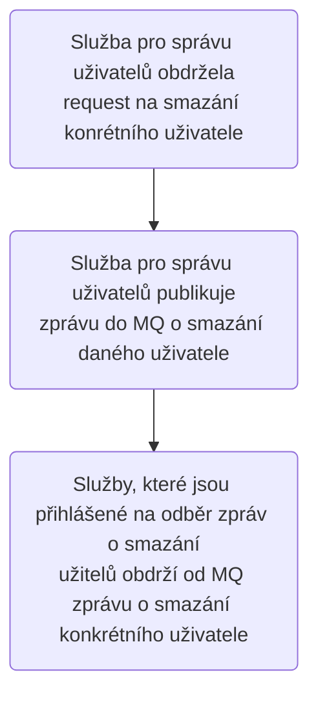
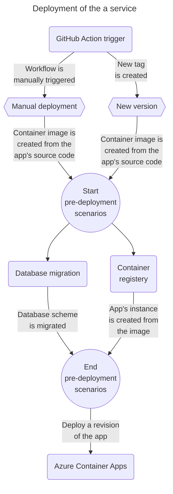

# Praktický projekt
---

## Úvod do projektu
Jde o reimplementaci systému pro podporu digitalizace dokumentů v
organizacích, kdy došlo k přesunu z monolitické architektury na mikroslužby.
Cílem této části je poskytnout praktickou ukázku (tzn. ukázka včetně zdrojového kódu) systému
využívající mikroslužby, přičemž tato část má sloužit jako doplňek k [business případům](./framework/business-cases),
které neodkazují na konkrétní zdrojový kód.

Co se týče funkcionality tohoto systému, tak jde o čtení obsahu na naskenovaných dokumentech a jejich archivace ve vhodném uložišti.

Odkaz na webovou aplikaci: [Digi - Vercel](https://mrf-web-app.vercel.app/)
### Implementace specifik mikroslužeb
#### Nezávislost služeb
Nezávislost služeb lze dosáhnout několika způsoby, kdy jedním z nich je využití asynchronní komunikace přes <abbr title="Message Queue">MQ</abbr> komponentu (třeba i za využití pub-sub patternu). Co se týče praktické ukázky této komunikace, tak ten je následující:

Co se týče implementace této funkcionality, tak tu lze vidět níže. Tento kód publikuje zprávu/událost s tématem (v aj. topic) 'user-delete' do MQ. Zdrojový kód celého balíčku je zde: [Workflow Service - implementace mazání uživatelů](https://github.com/MichalMoudry/mrf-user-service/blob/main/src/internal/service/user_service.go#L26-L36).
```go
// Method for deleting a user in the system.
func (srvc UserService) DeleteUser(ctx context.Context, userId string) error {
	err := srvc.FirebaseAuth.DeleteUser(ctx, userId)
	if err != nil {
		return err
	}

	if err = srvc.Dapr.PublishEvent(ctx, "user-delete", userId); err != nil {
		return err
	}
	return nil
}
```
V jiné službě je naimplementována funkce, který ze zaregistrována jako `handler` pro 'user-delete' událost. Registrace je konceptuálně podobná ve všech službách (v kontextu využití runtimu Dapr), ale může mít své specifika pro konkrétní programovací jazyky, jejich ekosystémy a frameworky (např. možnost využít middleware pro registraci v rámci ASP.NET Core). Registraci `handler` funkcí lze vidět níže (převzato z mého [projektu](https://github.com/MichalMoudry/mrf-workflow-service/blob/main/src/transport/dapr.go)).
```go
import (
	"net/http"
	"workflow-service/transport/util"
)

type Subscription struct {
	PubsubName string            `json:"pubsubname"`
	Topic      string            `json:"topic"`
	Metadata   map[string]string `json:"metadata,omitempty"`
	Route      Route             `json:"routes"`
}

type Route struct {
	Rules   []Rule `json:"rules,omitempty"`
	Default string `json:"default,omitempty"`
}

type Rule struct {
	Match string `json:"match"`
	Path  string `json:"path"`
}

func ConfigureSubscribeHandler(w http.ResponseWriter, _ *http.Request) {
	pubsubName := "mrf-pub-sub"
	v := []Subscription{
		{
			PubsubName: pubsubName,
			Topic:      "user-delete",
			Route: Route{
				Rules: []Rule{
					{
						Match: `event.type == "user-delete"`,
						Path:  "/users/delete",
					},
				},
				Default: "/users/delete",
			},
		},
	}

	util.WriteResponse(w, http.StatusOK, v)
}
```
Tato registrace se odkazuje na cestu `/users/delete`, přičemž webový server (konkrétně go-chi) má s touto cestou spojenou handler funkci _DeleteUsersData()_, jejíž implementace je tato:
```go
// A method for handling requests to delete all user's data.
func (handler *Handler) DeleteUsersData(w http.ResponseWriter, r *http.Request) {
	var eventData contracts.CloudEvent[string]
	log.Println("User delete started...")
	if err := util.UnmarshallRequest(r, &eventData); err != nil {
		util.WriteErrResponse(w, http.StatusBadRequest, err)
		return
	}
	log.Printf("Obtained an user-delete event for %v\n", eventData.Data)
	err := handler.Services.UserService.DeleteUsersData(r.Context(), eventData.Data)
	if err != nil {
		log.Println("User delete failed")
		util.WriteErrResponse(w, http.StatusInternalServerError, err)
		return
	}

	util.WriteResponse(w, http.StatusOK, nil)
}
```
!> Zde je dobré zmínit, že všechny Dapr v základu posílá zprávy na příjemce metodou POST.

#### Automatizace infrastruktury
Každá služba má definovanou (v YAML souboru) GitHub akci, která realizuje následující proces:

V tomto procesu nasazení jsou provedeny tyto akce:
- Migrace schématu příslušné databáze dle definovaných migrací v repositáři
- Paralelně s migrací databázového schématu dojde k sestavení Docker obrazu aplikace, který se následně nahraje na registrář/uložiště obrazů (v tomto případě jde o Docker Hub, ale lze třeba využít Azure Container Registry).
- Poslední část procesu se týká nasazení nové instance služby do Azure Container Apps cloudové služby.

Konkrétní příklad definice toho procesu lze nalézt níže:
```yaml
name: Deploy to Azure
on:
    push:
        branches: [ "main" ]
    release:
        types: [published]
    workflow_dispatch:
jobs:
    push_to_registery:
        name: Push Docker image
        runs-on: ubuntu-latest
        steps:
        - name: Check out the repo
            uses: actions/checkout@v4

        - name: Log in to Docker Hub
            uses: docker/login-action@v2
            with:
            username: ${{ secrets.REGISTRY_USERNAME }}
            password: ${{ secrets.REGISTRY_PASSWORD }}

        - name: Extract metadata (tags, labels) for Docker
            id: meta
            uses: docker/metadata-action@v4
            with:
            images: michalmoudry/analytics-service

        - name: Build and push Docker image
            uses: docker/build-push-action@v3
            with:
            context: ./src
            push: true
            tags: michalmoudry/analytics-service:latest
            labels: ${{ steps.meta.outputs.labels }}

    migrate_db:
        name: Migrate database schema
        runs-on: ubuntu-latest
        env:
        DB_SERVER_NAME: ${{ secrets.DB_SERVER_NAME }}
        DB_ADMIN_NAME: ${{ secrets.DB_ADMIN_NAME }}
        DB_ADMIN_PASSWORD: ${{ secrets.DB_ADMIN_PASSWORD }}
        steps:
        - name: Check out the repo
            uses: actions/checkout@v4

        - name: Pull go-migrate and migrate DB
            run: |
            docker pull migrate/migrate
            docker run -v ./src/AnalyticsService/Database/Migrations:/migrations --network host migrate/migrate -path=/migrations/ \
            -database postgres://$DB_ADMIN_NAME:$DB_ADMIN_PASSWORD@$DB_SERVER_NAME:5432/mrf?search_path=analytics up

    deploy:
        name: Deploy
        runs-on: ubuntu-latest
        needs: [push_to_registery, migrate_db]
        steps:
        - name: Check out the repo
            uses: actions/checkout@v4

        # https://learn.microsoft.com/en-us/azure/developer/github/connect-from-azure?tabs=azure-portal%2Clinux
        - name: Log in to Azure
            uses: azure/login@v1
            with:
            creds: ${{ secrets.AZURE_CREDENTIALS }}

        - name: Update subscription in app's config file
            uses: jacobtomlinson/gha-find-replace@v3
            with:
            find: "[subscription_id]"
            replace: ${{ secrets.AZURE_SUBSCRIPTION_ID }}
            regex: false
            include: "**app_template.yml"

        - name: Deploy Container App
            uses: azure/container-apps-deploy-action@v1
            with:
            imageToDeploy: docker.io/michalmoudry/analytics-service:latest
            resourceGroup: ${{ secrets.AZURE_RESOURCE_GROUP }}
            containerAppEnvironment: microservice-ref-framework-env
            containerAppName: analytics-service
            targetPort: 80
            ingress: external
            yamlConfigPath: ./.azure/app_template.yml

        - name: Enable dapr for a Container App
            uses: azure/CLI@v1
            with:
            inlineScript: |
                az containerapp dapr enable \
                -n analytics-service \
                -g ${{ secrets.AZURE_RESOURCE_GROUP }} \
                --dapr-app-id analytics-service \
                --dapr-app-protocol http \
                --dapr-app-port 80
```

#### Rozdělené systému na komponenty
V rámci projektu byly naimplementováno celkem 5 služeb, přičemž bylo použity celkem čtyři programovací jazyky (viz tabulka níže).

| Název služby         | Programovací jazyk |
|----------------------|--------------------|
| Recognition služba   | Python             |
| Workflow služba      | Go                 |
| User služba          | Go                 |
| Služba pro notifikace| C#                 |
| Služba pro analytiku | F#                 |

Zde lze vidět, že jde použít jiné programovací jazyky pro dosažení specifických úloh v systému. Jako např.:
- Pro aplikaci <abbr title="Optical Character Recognition">OCR</abbr> pro rozpoznávání obsahu na dokumentech byl využit Python, protože lze snadno realizovat úlohy v oblasti strojového učení.
- Využití jazyka Go pro psaní rychlých a malých služeb.
- Použití jazyka F# pro analytiku, protože přistupuje k imutabilitě dat implicitně třeba narozdíl od C# nebo Go.

> Pozn.: Imutabilita dat je jednou z charakteristik funkcionálních programovacích jazyků.

### Diagram tříd

### Diagram komponent

#### Detail instance služby

- Každá instance služby se skládá z následujících částí:
    - **Proces služby** - Jedná se o spuštěnou službu, která realizuje naprogramovanou logiku. Také může poskytovat rozhraní pro komunikaci (v tomto projektu jde o RESTové API pro komunikaci s API gateway nebo jinými klienty).
    - **daprd** - Jde o službu realizující roli Dapr klienta pro službu. S touto službou, resp. Dapr klientem komunikuje hlavní služba pro realizaci některých činností
    - (Dobrovolné) **Integrace se Service connector** - Tato část je pouze releventní pro deployment na MS Azure, kdy Service connector slouží pro připojování Azure Container Apps ke cloudovým službám.
        - Service connector přidává connection stringy do kontejnerů/replik, aby je mohly využít pro připojení. Tyto textové řetězce jsou přidávány ve formě proměnných prostředí nasazených kontejnerů.
### Deployment diagram systému


## Spuštění projektu
Jelikož celý systém je dekomponován na nezávislé služby, tedy je možné skrze [Dapr](https://dapr.io) si lokálně sestavit tento projekt. Pokud není třeba detailní demonstrace na lokálním prostředí, tak bylo vytvořeno webové GUI pro tento projekt, přičemž toto rozhraní je dostupné zde: [Digi - Vercel](https://mrf-web-app.vercel.app/).

!> Momentálně není **automatizovaný** způsob spuštění celého systému a jeho infrastruktury.

## Nasazování projektu
Ukázkový projekt byl vyvinut s MS Azure jako cílovou cloudovou platformou. Důvod, proč byla tato platforma zvolena, tak šlo o možnost využití serverless Dapr v kontextu Azure Container Apps. Lze tedy využít zdarma kredit pro Azure na nasazení pod vlastní subscription.

## Rozšiřování funkcionality systému
Jako jedno z možných cvičení pro získání on-hands zkušeností s mikroslužbami může být rozšíření uživatelské služby. Tato služba je napsána jako stateless (tzn. nevyužívá databázi), protože systém přijímá identitu od třetích stran (Google, Microsoft, GitHub).

Lze tedy modifikovat existující nebo vytvořit novou uživatelskou službu, aby spravovala v systému vlastní uživatele. Zde si lze vyzkoušet nezávislost služeb, kdy v tomto projektu skoro všechny ostatní služby jsou přihlášeny k odběru 'user-delete' události.
