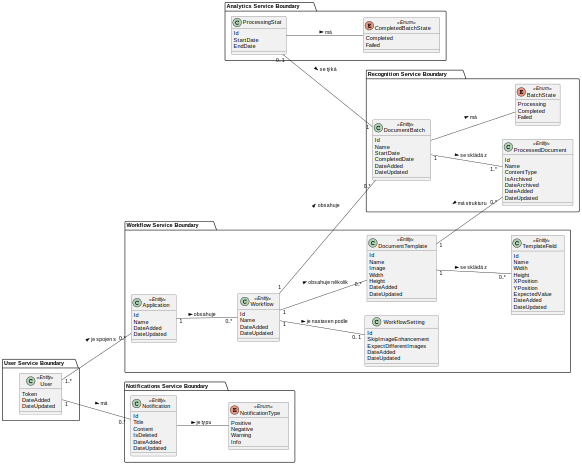
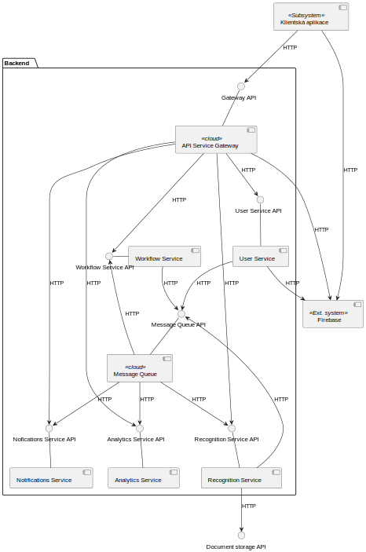
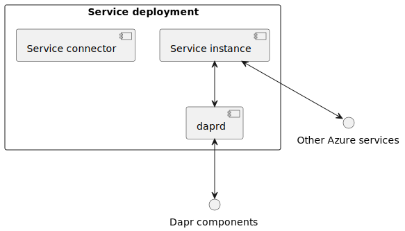
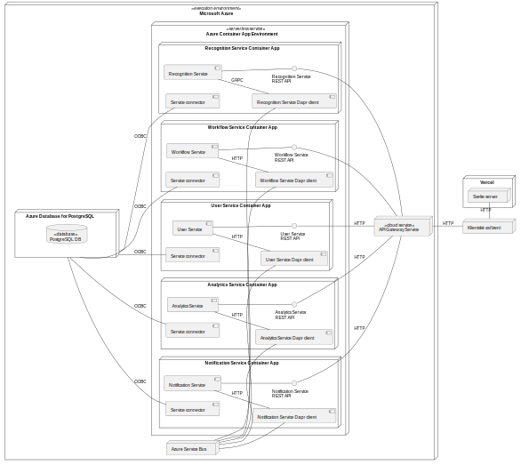

# Praktický projekt
---

## Úvod do projektu
Jde o reimplementaci systému pro podporu digitalizace dokumentů v
organizacích, kdy došlo k přesunu z monolitické architektury na mikroslužby.

Co se týče funkcionality tohoto systému, tak jde o čtení obsahu na naskenovaných dokumentech a jejich archivace ve vhodném uložišti.
### Diagram tříd

### Diagram komponent

#### Detail instance služby

- Každá instance služby se skládá z následujících částí:
    - Proces služby
    - daprd
    - (Dobrovolné) Integrace se Service connector - Tato část je pouze releventní pro deployment na MS Azure, kdy Service connector slouží pro připojování Azure Container Apps ke cloudovým službám.
        - Service connector přidává connection stringy do kontejnerů/replik, aby je mohly využít pro připojení.
### Deployment diagram systému

## Spuštění projektu
Jelikož celý systém je dekomponován na nezávislé služby, tedy je možné skrze [Dapr](https://dapr.io) si lokálně sestavit tento projekt. Pokud není třeba detailní demonstrace na lokálním prostředí, tak bylo vytvořeno webové GUI pro tento projekt, přičemž toto rozhraní je dostupné zde: [Digi - Vercel](https://mrf-web-app.vercel.app/).

!> Momentálně není **automatizovaný** způsob spuštění celého systému a jeho infrastruktury.

## Nasazování projektu
Ukázkový projekt byl vyvinut s MS Azure jako cílovou cloudovou platformou. Důvod, proč byla tato platforma zvolena, tak šlo o možnost využití serverless Dapr v kontextu Azure Container Apps. Lze tedy využít zdarma kredit pro Azure na nasazení pod vlastní subscription.

## Rozšiřování funkcionality systému
Jako jedno z možných cvičení pro získání on-hands zkušeností s mikroslužbami může být rozšíření uživatelské služby. Tato služba je napsána jako stateless (tzn. nevyužívá databázi), protože systém přijímá identitu od třetích stran (Google, Microsoft, GitHub).

Lze tedy modifikovat existující nebo vytvořit novou uživatelskou službu, aby spravovala v systému vlastní uživatele. Zde si lze vyzkoušet nezávislost služeb, kdy v tomto projektu skoro všechny ostatní služby jsou přihlášeny k odběru 'user-delete' události.
